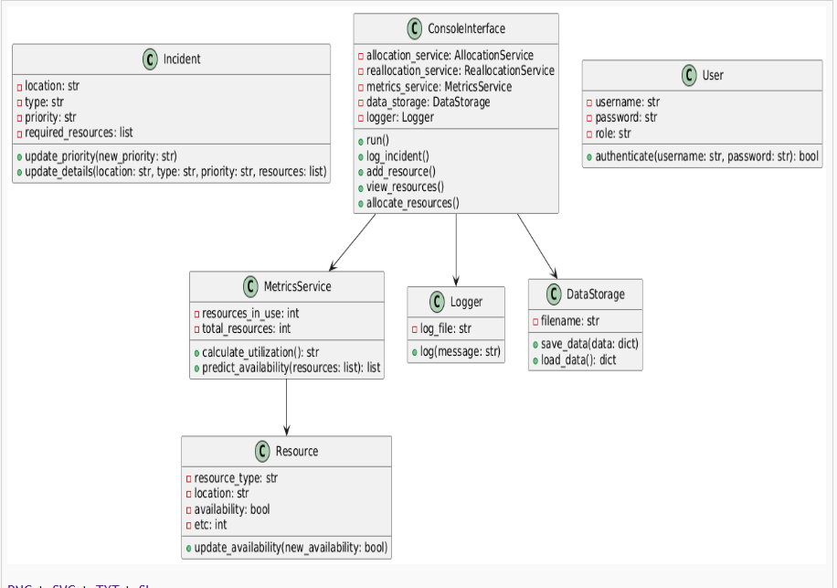

# Emergency Resource Allocation System

## Overview
The **Emergency Resource Allocation System** is a console-based application designed to manage and optimize resource allocation during emergency situations. It allows emergency coordinators to log incidents, manage resources, allocate resources based on priority, and track system activities.

This project demonstrates the use of object-oriented programming (OOP), modular design, and testing techniques to build a robust and maintainable application.

---

## Features
- **User Authentication**: Role-based access control for admins, coordinators, and viewers.
- **Incident Management**: Log, update, and view emergency incidents.
- **Resource Management**: Add, update, and view available resources.
- **Resource Allocation**: Allocate resources to incidents based on priority, availability, and proximity.
- **Dynamic Reallocation**: Reallocate resources when new high-priority incidents arise.
- **Resource Utilization Metrics**: Track and display resource usage statistics.
- **Historical Data and Reporting**: Save and load incidents and resources, and generate reports.
- **Activity Logging**: Track all user actions and system events in a log file.

---

## Project Structure
```plaintext
emergency-resource-allocation
├── src
│   ├── main.py                     # Entry point of the application
│   ├── models                      # Contains data models
│   │   ├── incident.py             # Incident model
│   │   ├── resource.py             # Resource model
│   │   └── user.py                 # User model for authentication
│   ├── services                    # Contains business logic
│   │   ├── allocation_service.py   # Handles resource allocation
│   │   ├── reallocation_service.py # Handles resource reallocation
│   │   └── metrics_service.py      # Handles resource utilization metrics
│   ├── utils                       # Utility functions and helpers
│   │   ├── data_storage.py         # Handles saving/loading data
│   │   ├── input_validation.py     # Validates user inputs
│   │   └── logger.py               # Logs system activities
│   ├── ui                          # User interface components
│   │   └── console_interface.py    # Console-based UI
├── tests                           # Unit tests for the application
│   ├── test_allocation_service.py  # Tests for allocation logic
│   ├── test_reallocation_service.py# Tests for reallocation logic
│   ├── test_metrics_service.py     # Tests for metrics logic
│   ├── test_incident.py            # Tests for the Incident model
│   ├── test_resource.py            # Tests for the Resource model
│   └── test_user.py                # Tests for the User model
├── [uml_diagram.puml](http://_vscodecontentref_/3)                # PlantUML script for the UML Class Diagram
├── [uml_diagram.png](http://_vscodecontentref_/4)                 # Generated UML Class Diagram
├── [requirements.txt](http://_vscodecontentref_/5)                # Python dependencies
├── [README.md](http://_vscodecontentref_/6)                       # Project documentation
└── [activity.log](http://_vscodecontentref_/7)                    # Log file for tracking system activities

How to Run the Application

1. Clone the Repository

git clone <repository-url>
cd emergency-resource-allocation

2. Install Dependencies
Ensure you have Python installed. Install the required dependencies:

pip install -r [requirements.txt](http://_vscodecontentref_/5)

3. Run the Application
Start the application by running:

python [main.py](http://_vscodecontentref_/4)

4. Run Tests
Run the unit tests to ensure everything is working correctly:

set PYTHONPATH=src
python -m unittest discover -s tests

Components
1. Models
incident.py: Represents an emergency incident with attributes like location, type, priority, and required resources.
resource.py: Represents a resource with attributes like type, location, availability, and estimated time to completion (ETC).
user.py: Represents a user with attributes like username, password, and role (e.g., admin, coordinator).
2. Services
allocation_service.py: Handles the logic for allocating resources to incidents.
reallocation_service.py: Handles reallocation of resources when priorities change.
metrics_service.py: Tracks resource utilization and predicts resource availability.
3. Utilities
data_storage.py: Saves and loads data (e.g., incidents, resources) to/from a JSON file.
input_validation.py: Validates user inputs to ensure data integrity.
logger.py: Logs all user actions and system events to a log file (activity.log).
4. User Interface
console_interface.py: Provides a text-based menu for interacting with the system.
5. Tests
Unit tests for all components, including models, services, and utilities.

Logging
All user actions and system events are logged in the activity.log file. This includes:

User logins and actions.
Incidents and resources added or updated.
Resource allocation and reallocation events.
Example log entries:
[2025-04-09 10:00:00] User logged in as admin.
[2025-04-09 10:05:00] New incident logged: Zone 1, Fire, High Priority.
[2025-04-09 10:10:00] Resource added: Ambulance, Zone 2, Available.
[2025-04-09 10:15:00] Resources allocated to incidents.

Features in Action
Main Menu
When the program starts, the main menu is displayed:
Welcome to the Emergency Resource Allocation System!
Please select an option:
1. Log a new incident
2. Add a new resource
3. View incidents
4. View resources
5. Allocate resources
6. View resource utilization metrics
7. View historical data
8. Exit

Example Outputs
1. Logging a New Incident:

Enter incident details:
Location: Zone 1
Type of emergency: Fire
Priority level (high/medium/low): High
Required resources (comma-separated): Fire Truck, Medical Team

Incident logged successfully!

2. Adding a New Resource:
Enter resource details:
Resource type: Ambulance
Location: Zone 2
Availability (yes/no): yes

Resource added successfully!

3. Viewing Resource Utilization Metrics:

Resource Utilization Metrics:
Resource Utilization: 50.00%

4. Predicting Resource Availability:
Resource Availability Predictions:
Resource: Ambulance, Location: Zone 2, Available in: 10 minutes

## UML Class Diagram

Below is the UML Class Diagram for the Emergency Resource Allocation System:



Future Improvements
Add a graphical user interface (GUI) for better usability.
Integrate with external APIs for real-time resource tracking (e.g., GPS).
Implement machine learning for predictive resource allocation.
Add multi-language support for broader accessibility.

plantuml

